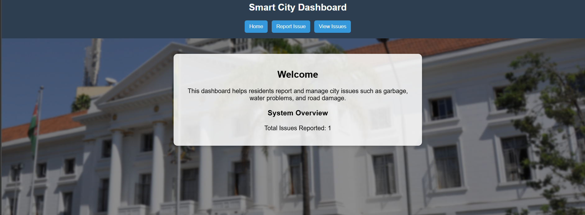
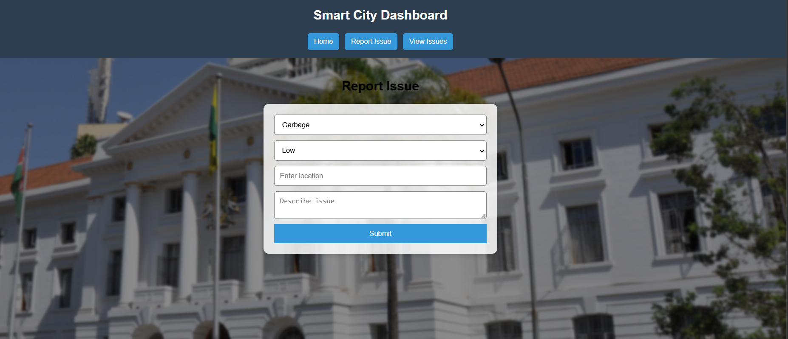
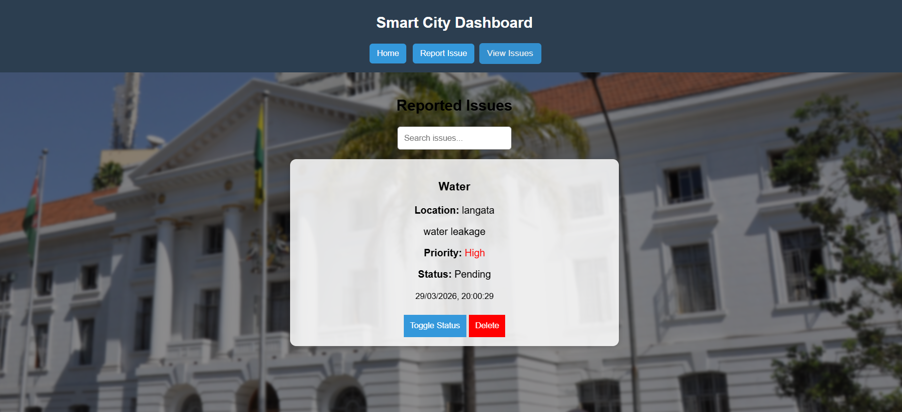

# SmartCity Dashboard

A real-time web dashboard for residents and city administrators to report, track, and manage urban issues such as garbage collection, water problems, and road damage.



## Problem

Cities often struggle with fragmented systems for reporting and tracking civic issues. Citizens and administrators lack a centralized, easy-to-use platform to report problems and get real-time insights into city operations.

**SmartCity Dashboard** provides a clean and responsive interface where residents can easily report issues and administrators can monitor and manage them efficiently.

## Features

- Report new issues with category, priority, location, and description
- View all reported issues with search functionality
- Toggle issue status and delete records
- Clean, modern UI with real building background
- Mobile-friendly responsive design
- Real-time overview of total reported issues

## Screenshots

### 1. Home / Dashboard Overview

*Welcome screen showing total issues reported*

### 2. Report Issue Form

*Form to report new city issues (Garbage, Water leakage, Road damage, etc.)*

### 3. Reported Issues List

*View and manage reported issues with status, priority, and action buttons*

## Tech Stack

- **Frontend**: React, Tailwind CSS
- **Backend**: Node.js, Express
- **Database**: MongoDB
- **Visualization**: Chart.js (planned for future updates)

## Installation & Setup

### Prerequisites

- Node.js (v18 or higher)
- MongoDB (installed and running)

### Steps

1. Clone the repository:
   ```bash
   git clone https://github.com/KaranjaElizabeth34/smartcity-dashboard.git
   cd smartcity-dashboard
   # Backend
cd backend
npm install

# Frontend (open a new terminal)
cd frontend
npm install

PORT=5000
MONGO_URI=mongodb://localhost:27017/smartcity
JWT_SECRET=your_super_secret_key_here

# Start MongoDB (if running locally)
mongod

# Backend (in one terminal)
cd backend
npm run dev

# Frontend (in another terminal)
cd frontend
npm run dev

Open your browser at http://localhost:3000
Usage
Use the Home tab to see the overview
Click Report Issue to submit new complaints
Go to View Issues to manage reported problems
Contributing
Fork the project
Create your branch (git checkout -b feature/amazing-feature)
Commit changes (git commit -m 'Add amazing feature')
Push (git push origin feature/amazing-feature)
Open a Pull Request

License

MIT License

Future Work
User authentication (Citizen vs Admin roles)
Interactive charts and analytics with Chart.js
Live notifications
AI-powered issue prioritization
Map integration (Google Maps or Leaflet)
Fully mobile-responsive improvements

Made for smarter, more responsive cities.
If you face any issues during setup, feel free to open an issue!
